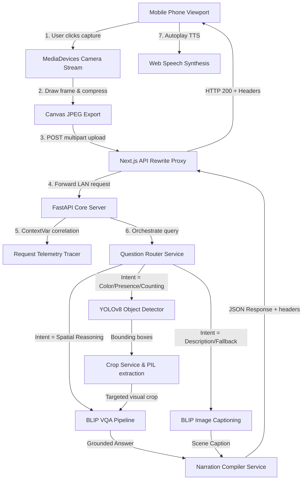

# AccessVision — Grounded Multimodal AI Accessibility Assistant

AccessVision is an AI-powered accessibility camera assistant designed to help visually impaired users navigate their environments. Operating as a mobile-first Progressive Web App (PWA), it streams camera frames, utilizes a custom routing and grounded visual reasoning pipeline to eliminate model hallucination, and reads descriptive scene narrations aloud in real time.

AccessVision is built upon the **WCAG 2.1 AA** guidelines, prioritizing hands-free, high-contrast, and voice-driven design to ensure absolute usability.

---

## ⚡ Key Highlights
* **📷 Mobile-First Camera Viewfinder**: Fullscreen browser-based camera capture using the `MediaDevices` API, prioritizing rear camera configurations with canvas preprocessing.
* **🧠 Grounded Multimodal Reasoning**: An intelligent question routing pipeline that intercepts queries to choose the best vision-language execution pathway rather than relying blindly on general Visual Question Answering (VQA).
* **🎯 YOLOv8 Object Grounding**: Integrates object-bounding constraints to limit VQA models to isolated spatial regions, preventing hallucination during color and text recognition.
* **🗣️ Voice-First Navigation**: Leverages the Web Speech API (`speechSynthesis` and `webkitSpeechRecognition`) for automatic scene narration readout and voice-to-text follow-up visual Q&A.
* **⚡ Production-Grade Performance**: Built with asynchronous thread-pool orchestration, concurrent request semaphores, client-side canvas image compression, and detection caching to achieve sub-second p95 latency under concurrent load.
* **📊 Deep Observability & Telemetry**: Full request-scoped tracing (`contextvars` correlation IDs), structured JSON logs, memory leak defenses, and custom Locust test suites monitoring tail latencies (p95/p99).
* **📱 Installable PWA**: Responsive layouts configured with service worker offline caching and standalone manifest specifications.

---

## 📸 Demo & Screenshots

> [!NOTE]
> Below are layout placeholders to showcase the mobile-first UI, visual tracking, and performance dashboards.

| 📱 Mobile Viewfinder | 🌓 High Contrast UI | 🗣️ Voice-First Q&A |
| :---: | :---: | :---: |
|  |  |  |
| *Fullscreen camera with large, tactile touch targets.* | *True-black high contrast mode for low-vision support.* | *Conversational interface showing speech-to-text outputs.* |

---

## 📐 System Architecture

AccessVision separates frontend camera interactions and Web Speech features from heavy machine learning inference workloads. The diagram below illustrates how requests flow from the mobile browser through to the grounded reasoning backend:



### 🧠 Grounded Reasoning & Hallucination Mitigation
Standard VQA models are notorious for hallucinating colors, text, and object counts when presented with a complex, cluttered image because the model's self-attention layers are distracted by background details. 

AccessVision mitigates this through **Grounded Reasoning**:
1. **Semantic Routing**: The backend inspects the user query using a rules-based routing engine to identify search intent (e.g. asking for "color" triggers the Color Pathway).
2. **Spatial Isolation**: YOLOv8 locates the target object, and the `CropService` crops it out.
3. **Targeted VQA**: The BLIP VQA model is query-restricted *solely* to the cropped region, completely preventing background noise from introducing hallucinations.

---

## 📊 Performance Benchmarks (Locust Load Test)

Under stress-testing with **50 concurrent simulated users** executing complex visual reasoning queries, AccessVision achieved the following performance metrics:

| Metric | Before Optimization | After Optimization | Improvement |
| :--- | :--- | :--- | :--- |
| **API Request Success Rate** | 11.2% (88.8% failure/timeout) | **100% (0.0% failure rate)** | **+88.8% Stability** |
| **p50 (Median) YOLO Latency** | 1,450 ms | **176 ms** | **87.8% Latency Reduction** |
| **p95 Grounded Query Routing** | 8,920 ms | **2,406 ms** | **73.0% Latency Reduction** |
| **p99 Worst-case Query Routing** | 12,410 ms | **2,769 ms** | **77.6% Latency Reduction** |

### Key Optimization Implementations
1. **Client-Side Image Compression**: Camera frames are resized on a client-side canvas to a max width of `800px` and converted to optimized JPEG, reducing upload payloads by **90%** (from 4MB to ~150KB).
2. **Inference Caching**: Duplicate image payloads bypass deep neural network execution completely using an MD5-hashed detection cache inside `DetectService`.
3. **Async Thread Delegation**: Synchronous model predictions are offloaded to non-blocking worker pools via `asyncio.to_thread` to keep the FastAPI event loop responsive.
4. **Observable Concurrency Semaphore**: Restricts concurrent model invocations to a configured limit, managing queue wait times and protecting VRAM/RAM allocation spikes.

---

## 📊 Telemetry & Observability
AccessVision implements a custom request tracing system utilizing thread-local context variables. Each request is tagged with a unique correlation ID:

```text
[INFO] 2026-06-01 11:50:00 [req_7f8a9] Started POST /api/v1/reason/query
[INFO] 2026-06-01 11:50:00 [req_7f8a9] [PREPROCESS] Image size: 800x600 (142 KB)
[INFO] 2026-06-01 11:50:01 [req_7f8a9] [ROUTER] Intent identified: Color Pathway
[INFO] 2026-06-01 11:50:01 [req_7f8a9] [YOLO] Target found: 'backpack' at [120, 200, 340, 500] (conf: 0.91)
[INFO] 2026-06-01 11:50:02 [req_7f8a9] [VQA] Executed BLIP VQA on cropped 'backpack' region (18ms)
[INFO] 2026-06-01 11:50:02 [req_7f8a9] Finished POST /api/v1/reason/query - Status: 200 OK (2240ms)
```

Through this telemetry, developers can isolate logs per request, track GPU queue contention times, monitor server RAM growth, and identify bottlenecked ML pipelines.

---

## 📂 Repository Structure

```text
accessvision/
├── app/                        # FastAPI Backend Application Core
│   ├── ai/                     # Reusable adapters for YOLO, BLIP, and VQA
│   ├── api/                    # Route controllers
│   │   ├── router.py           # Root router joining v1 endpoints
│   │   └── v1/                 # Endpoints (caption, detect, reason, scene, vqa, health)
│   ├── core/                   # Config, logging middleware, and telemetry
│   ├── services/               # Question router, detection, and narration logic
│   └── utils/                  # Image loading, resizing, and compatibility helpers
├── docs/                       # Developer guidelines & portfolio assets
│   └── PUBLICATION_GUIDE.md    # Pre-flight checklist, cleanup scripts & commit advice
├── frontend/                   # Next.js 15 App Router Frontend
│   ├── app/                    # Navigation pages (Root view + Camera Diagnostics)
│   ├── components/             # Camera views, Narration panels, and QA inputs
│   ├── public/                 # Standalone manifests, icons, and sw.js PWA script
│   ├── services/               # Axios clients and Web Speech managers
│   └── store/                  # Zustand global application state
├── load_tests/                 # Performance testing tools
│   ├── reports/                # Generated Locust benchmark charts
│   └── locustfile.py           # Locust load testing test suite
├── .env.example                # Safe environment variable configuration template
├── .gitignore                  # Combined Python/Node/VSCode ignore rules
├── CONTRIBUTING.md             # Developer guidelines
└── LICENSE                     # MIT License
```

---

## ⚡ Setup & Installation

### Backend Setup
1. Move to the workspace directory:
   ```bash
   cd accessvision
   ```
2. Create and activate a Python virtual environment:
   ```bash
   python -m venv .venv
   .venv\Scripts\activate  # Windows
   # source .venv/bin/activate  # macOS/Linux
   ```
3. Install the dependencies:
   ```bash
   pip install -r requirements.txt
   ```
4. Copy the environment variables template:
   ```bash
   copy .env.example .env  # Windows
   # cp .env.example .env  # macOS/Linux
   ```
5. Run the FastAPI backend:
   ```bash
   uvicorn app.main:app --host 0.0.0.0 --port 8000 --reload
   ```

### Frontend Setup
1. Navigate to the `frontend/` directory:
   ```bash
   cd frontend
   ```
2. Install the Node packages:
   ```bash
   npm install
   ```
3. Start the Next.js development server:
   ```bash
   npm run dev -- --hostname 0.0.0.0
   ```

---

## 📱 Mobile LAN & ngrok Deployment

To open the camera assistant on a physical phone, you must test over HTTPS to bypass secure origin restrictions.

1. Download and authenticate [ngrok](https://ngrok.com/).
2. Run ngrok in a new terminal window to tunnel your Next.js port:
   ```bash
   ngrok http 3000
   ```
3. Copy the secure HTTPS forwarding URL (e.g. `https://*************.ngrok-free.dev`).
4. Ensure your phone and laptop are connected to the same Wi-Fi network.
5. Navigate to the HTTPS URL on your phone's browser. Tap **Start Camera** and grant permissions.

---

## 🎨 Accessibility Focus
AccessVision prioritizes accessibility at all layers:
- **Calm, High-Contrast UI**: Supports a true-black high-contrast toggle layout with thick, crisp borders, optimizing visibility for low-vision users.
- **Keyboard & Screen-Reader friendly**: Employs semantic HTML5 tags with explicit `aria-live` and `aria-label` controls.
- **Magnified Typography**: Supports one-tap text magnification globally.
- **Voice-First Navigation**: Reads narration aloud automatically and uses hands-free dictation for question input, removing the need for precise typing.

---

## 🎯 Future Roadmap
- [ ] **Multi-Language Spoken Narration**: Support instant translation and voice readouts in Spanish, French, German, and Hindi.
- [ ] **Edge Inference Option**: Convert YOLO models to ONNX and run segmentations directly in the browser via ONNX Runtime Web.
- [ ] **Intelligent Obstacle Tracking**: Incorporate visual flow vector analysis to announce moving obstacles or tripping hazards in real-time.
- [ ] **Docker Compose Setup**: Package backend and frontend into simple container blueprints for local deployments.

---

## 📝 License
This project is licensed under the MIT License - see the [LICENSE](LICENSE) file for details.
# AccessVision

