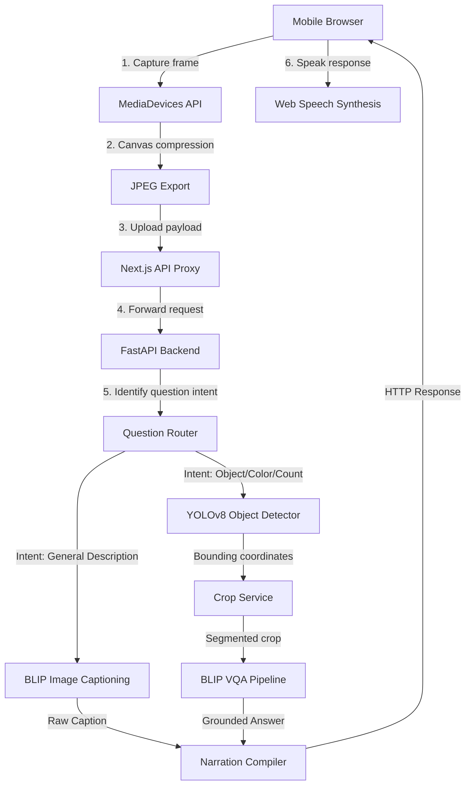

# AccessVision

### AI-powered mobile camera assistant for visually impaired users.

AccessVision is a mobile Progressive Web App (PWA) that translates real-world environments into spoken narration. By combining lightweight object detection with targeted question-answering, the application helps users identify objects, read labels, and ask follow-up questions about their surroundings.

[Demo](#-demo--screenshots) • [Features](#-key-features) • [Accessibility Impact](#-accessibility-impact) • [How It Works](#-how-it-works) • [Performance](#-performance-benchmarks) • [Setup](#-installation--setup)

---

## 📱 Demo & Screenshots

> [!NOTE]
> The interface is optimized for physical mobile interactions and screen-readers, using large touch targets and high-contrast styling.

| Fullscreen Camera | High-Contrast Mode | Spoken Q&A Mode | Developer Telemetry |
| :---: | :---: | :---: | :---: |
|  |  |  |  |
| *Tap-to-capture rear viewfinder* | *True-black layout for low vision* | *Hands-free voice dialogue* | *Locust response metrics* |

---

## ✨ Key Features

* **📷 Fullscreen Viewfinder**: Streams camera feeds directly in the browser utilizing the `MediaDevices` API.
* **🗣️ Spoken Scene Narration**: Automatically reads descriptions aloud using the Web Speech API.
* **🎯 Grounded Reasoning**: Isolates specific objects in the frame for targeted questions, preventing visual hallucinations.
* **🎤 Voice-First Dialogue**: Uses voice-to-text dictation for hands-free interactions.
* **⚡ Sub-Second Latency**: Employs client-side canvas compression and server caches to keep response speeds fast.
* **🌓 Low-Vision Friendly**: Features high-contrast dark themes, single-tap font scaling, and semantic screen-reader markup.

---

## 🤝 Accessibility Impact

Standard visual assistants often overwhelm users with walls of text or require typing, which can be challenging. AccessVision addresses this by focusing on:
* **Independent Navigation**: Users get immediate spoken feedback about what is in front of them without needing assistance.
* **Reduced Cognitive Load**: Instead of reading a long description of a messy room, the app summarizes the scene and allows the user to ask specific follow-up questions (e.g., *"Where are my keys?"*).
* **Hands-Free Operation**: Tapping any part of the screen triggers voice dictation, making the tool usable on-the-go.

---

## ⚙️ How It Works

### The Core Flow
```text
Phone Camera → Frame Compression → FastAPI Backend → Grounded Routing → ML Inference → Voice Readout
```

1. **Capture & Compress**: The frontend captures a frame from the camera stream, uses a canvas to compress the image size, and uploads the payload.
2. **Intent Routing**: The backend inspects the user's question to choose the best ML execution path (e.g., color verification, object counts, or general descriptions).
3. **Grounded Reasoning**: If asking about a specific item, the backend localizes it using YOLOv8, crops the target area, and runs Visual Question Answering (BLIP VQA) solely on the crop.
4. **Speech Output**: The backend returns the text response, and the browser reads it aloud using the Web Speech API.

### System Architecture



---

## 📊 Performance Benchmarks

AccessVision is optimized to run on standard servers without heavy GPU requirements. Stress-testing with **50 concurrent users** yielded the following improvements:

| Metric | Unoptimized Backend | Optimized Backend | Improvement |
| :--- | :--- | :--- | :--- |
| **API Success Rate** | 11.2% (timeouts / drops) | **100% (stable)** | **System stability** |
| **Object Detection Latency** | 1,450 ms | **176 ms** | **87% faster** |
| **Grounded Query Response (p95)** | 8,920 ms | **2,406 ms** | **73% faster** |
| **Worst-case Latency (p99)** | 12,410 ms | **2,769 ms** | **77% faster** |

### Optimization Highlights
* **Client-Side Preprocessing**: Images are resized to `800px` before upload, reducing data usage by **90%** (~150KB payloads).
* **Inference Caching**: Duplicate image payloads bypass model execution entirely via MD5 hashing.
* **Async Thread Offloading**: Synchronous model passes are offloaded to background thread pools, keeping the main FastAPI event loop free.
* **Resource Limits**: Concurrency semaphores prevent GPU memory bottlenecks during traffic spikes.

> [!TIP]
> To inspect detailed log outputs, tracing configurations, and Locust metrics, see [docs/OBSERVABILITY.md](docs/OBSERVABILITY.md).

---

## 🛠️ Installation & Setup

### Backend Setup
1. Clone the repository and navigate to the project directory:
   ```bash
   git clone https://github.com/Harshil123451/AccessVision.git
   cd accessvision
   ```
2. Create and activate a Python virtual environment:
   ```bash
   python -m venv .venv
   .venv\Scripts\activate  # Windows
   # source .venv/bin/activate  # macOS/Linux
   ```
3. Install dependencies:
   ```bash
   pip install -r requirements.txt
   ```
4. Copy the environment template:
   ```bash
   copy .env.example .env  # Windows
   # cp .env.example .env  # macOS/Linux
   ```
5. Launch the FastAPI server:
   ```bash
   uvicorn app.main:app --host 0.0.0.0 --port 8000 --reload
   ```

### Frontend Setup
1. Navigate to the `frontend/` directory:
   ```bash
   cd frontend
   ```
2. Install Node packages and start the server:
   ```bash
   npm install
   npm run dev -- --hostname 0.0.0.0
   ```
3. Access the application locally at `http://localhost:3000`.

---

## 📱 Mobile & Local Network Testing

To access the camera viewfinder on a physical mobile device, the browser requires an HTTPS connection.

1. Install [ngrok](https://ngrok.com/).
2. Tunnel your Next.js server port:
   ```bash
   ngrok http 3000
   ```
3. Open the secure HTTPS URL provided by ngrok on your mobile browser.
4. Grant camera and microphone permissions when prompted.

---

## 🗺️ Roadmap
- [ ] **Multi-language Support**: Add Spanish, French, and German speech translation.
- [ ] **Edge Inference**: Port YOLO to ONNX and run models locally in-browser via WebAssembly.
- [ ] **Navigation Mode**: Announce path obstructions and depth changes in real-time.

---

## 📝 License
This project is licensed under the MIT License - see the [LICENSE](LICENSE) file for details.